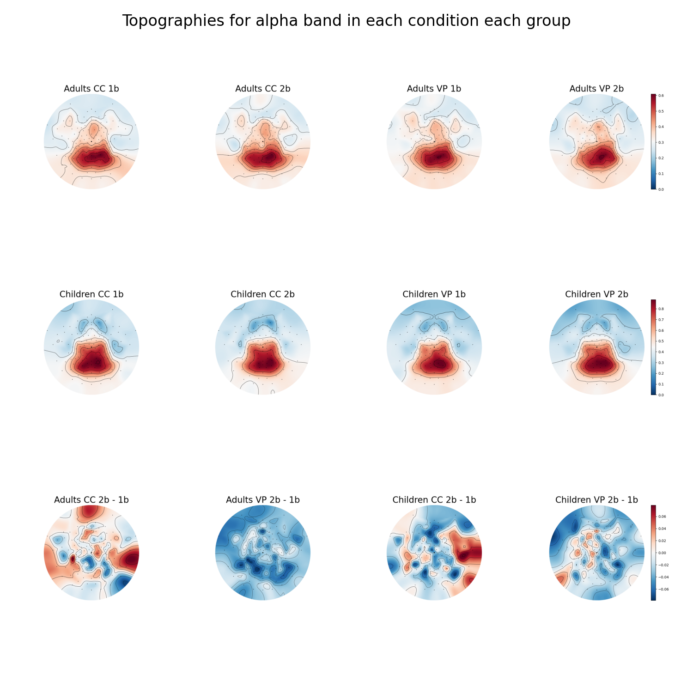

# FOOOF-CUHK

 


This project encompasses the development and application of the Fitting Oscillations & One Over F ([FOOOF](#FOOOF "Fitting Oscillations & One Over F")) code within Prof. Urs Maurer's Cognitive Neuroscience Lab at the Chinese University of Hong Kong ([CUHK](#CUHK)). The preparation of this document and tutorial is funded by the Hong Kong Polytechnic University ([PolyU](#The Hong Kong Polytechnic University)) start-up grant (P0043827) awarded to Dr. Shuting Huo. This code includes [FOOOF](#FOOOF "Fitting Oscillations & One Over F") processing, conducting statistical tests and plotting figures in Python and R. The work is published in Biological Psychology, https://doi.org/10.1016/j.biopsycho.2024.108824. The code was developed based on the package and tutorial from Thomas Donoghue's team: [FOOOF - fitting oscillations & one over f — fooof 1.1.0 documentation (fooof-tools.github.io)](https://fooof-tools.github.io/fooof/index.html). 

| Abbreviation | Full Form |
|--------------|-----------|
| [CUHK](#The Chinese University of Hong Kong) | The Chinese University of Hong Kong |
| [PolyU](#The Hong Kong Polytechnic University) | The Hong Kong Polytechnic University |
| [FOOOF](#FOOOF "Fitting Oscillations & One Over F") | Fitting Oscillations & One Over F |
| [ap](#ap "aperiodic component") | aperiodic component|
| [p](#p "periodic component") | periodic component|
| [CF](#CF "central frequency") | central frequency|
| [PW](#PW "periodic component") | power|
| [BW](#BW) | bandwidth|
| [sd](#sd "standard deviation") | standard deviation|
| [se](#se 'standard error') | standard error|

## About this file

This file is the guildline for using the code to analyze the provided sample data. The code and documentation for this project were primarily authored by Junior Research Assistant Tak Kwan Lam, and were subsequently reviewed and refined by Research Assistant Professor Dr. Shuting Huo and Junior Research Assistant Yuxi Chen. Since the coder majored in Psychology rather than Computer Science, there is still room for improvement and optimization in this code. This project is only meant to demonstrate the pipeline of FOOOF analysis in Python. We strongly recommend you to read the original work by Thomas for more information and details about [FOOOF](#FOOOF "Fitting Oscillations & One Over F"). Due to the compression in PDF format, please refer to the provided .png files for the best visual experience. This tutorial is written in Typora markdown so it is recommended to use the .md file with Typora markdown reader for the best experience.


## Project structure overview


The current project includes fourteen folders, five Python scripts and three R scripts. We can firstly ignore those folders and starts by seeing the codes. The number in the file name indicates the sequence of running and output. Let's start by opening the `1 fooof preprocess.py`.

### 1 FOOOF preprocess


We start by specifying the variables and directories for the input and output folders. You may want to refer to other sources (e.g., generative AI) for more details in these codes. As shown above, the raw data was read from the `input data` folder and the output was stored in `2 alpha` and `2 theta` (shown below) folders.


The above image shows the content in the input data folder, which is the frequency data of each channel.


Inside the .csv file are the voltage (mV) at 1 to 40 Hz frequency (V1 to V40) for every subject. The information for each participant can be found in the last four columns: subject ID (id), experiment conditions (exp, within subject factor), memory load (load, within subject factor), and group (age, adults vs. children, between subject factor).


You can also use your own data following the above format and named them by the format `EEG[channel num]_[frequency band name]_raw.csv`

The `1 fooof preprocess` code generates the FOOOF-processed data for each channel and stored in folders corresponding to frequency bands.


The `.png` file (shown below) in the 2 alpha folder indicate the function of FOOOF and parameters.


The black curve is the original data read from input data. The blue dashed-curve is the aperiodic ([ap](#ap "aperiodic component")) component modulated by FOOOF. The red curve is the full model combining the aperiodic ([ap](#ap "aperiodic component")) and periodic ([p](#p "periodic component")) components, labeled as the 'Full Model' in the legend. The two gaussian green area is the periodic components. The peak parameters were provided for one of them: center frequency (the center frequency number of this peak), power (the relative power separated from [ap](#ap "aperiodic component") component of the [p](#p "periodic component") component), and bandwidth (the frequency range width for this peak). The x-axis is the frequency ranged from 2~25 and y-axis is the logged power.


 ### [FOOOF](#FOOOF "Fitting Oscillations & One Over F")ed output

The .csv files in `2 alpha` and `2 theta` folders are the  is the [FOOOF](#FOOOF "Fitting Oscillations & One Over F")ed data for each participant in each condition, including [CF](#CF "central frequency") = center frequency, [PW](#PW 'power') = log(power), [BW](#BW) = bandwidth, offset is the intercept for the [ap](#ap "aperiodic component") component and exponent is the slope for [ap](#ap "aperiodic component") component. r_squared is the model $ r^2 $ (higher number means better fitting). And error is the mean squared error of the model. Noted that there might be multiple peaks for a participant in a condition. Hence, we need to distinguish and filter the data for statistical analysis.


## 2 stat alpha

The beginning section of `2 stat alpha.py` also specified the variables and directories for input and output folder. `3 alpha_stat` folder stores the statistical results and the `4 alpha pic` folder stores the generated graphs. The current file also includes the code for plotting graphs, which might increase the difficulty in adapting this code to other data. It is recommended to separate the codes for statistical analysis and plotting.


Redundant peaks that do not falls within the alpha frequency band (CF <= 8.2 Hz or CF >= 13.5 Hz) were filtered out and stored in`[Original file name]_peak_else_sub.csv`.


And we replaced the filtered data with [CF](#CF "central frequency") = None, [PW](#PW "power") and [BW](#BW "bandwidth") = 0. Fittings with $r^2$ <= 0.7 were also filtered out.


For the circumstances in which one participant shows multiple peaks in one condition, the peak with largest [PW](#PW "power") was kept. The filtered data is stored as `[Original file name]_stat_data.csv`


The `stat_data` is the dataframe containing the electrode data in the alpha band for all participants and conditions. The parameters were then averaged by subjects and conditions to avoid possible missing values in some channels. But if all channels are the missing values, the data here would still be [CF](#CF "central frequency") = None, [PW](#PW "power") and [BW](#BW "bandwidth") = 0.

 

Additionally, we have written a script to verify whether the averaged dataframe includes data for each subject and condition. You may adjust the parameters in this script to align with your experimental design.


And the averaged dataframe is stored as `mean_alpha_params.csv` in the output folder:


### Statistical testing

Our research interest is whether the n-back load modulated the periodic oscillations so we want to test if these parameters are significantly different between loads. To do this, we subtracted the five parameters from load 2b condition by 1b condition, then perform statistical analyses for each age group and each parameter. This data is stored as `mean_alpha_delta_nback_params.csv` and the t-test result stores in `one_sample_t_test.csv`.


### plotting results

To visualize the filtered data and statistical results, we utilize the functions from Thomas's [FOOOF](#FOOOF "Fitting Oscillations & One Over F") package. A function to lighten the color for each subject's curve was also included. More details for plotting are covered below.

Fig 4 alpha.png


Fig 3 a.png


Fig 3 g.png

The functions for plotting:


#### Fig4 alpha

The data for this plot is calculated by adding the power values of periodic (`y_p` function) and aperiodic (`y_ap` function) components together. The plot data outputs as `p+ap_alpha_load.csv`, which includes each participant's data. 

 

Then we averaged the power values by conditions so that we have one data for and condition each frequency for visualization.


What's worth noticing is that we have a box at the left bottom of each subplot. It's the t values in the one sample t test. The text in the left column is formatted using LaTeX to visually represent mathematical expressions, such as $/Delta ap_{off}$. Note that the asterisks for significance were not added automatically. 

Instead, cell colors were used to indicate significant results. Which can help you identify which cell to add the mark. Orange cell color indicates .05 level significance at t > 0, while blue indicates .05 level significance at t < 0. This code also add a montage picture in gray scale from the `montage pic/alpha.png`at the first subplot.


The final figures are shown below:


#### Fig 3 a & Fig 3 g 

This plot is about plotting the aperiodic components in each condition each group., you can adjust the settings based on your need. The data input is the same as the previous plot, except the periodic component in the merged_df is subtracted (see row 367). 


The selected color are `['#797BB7', '#E79397', '#80BA8A', '#51B1B7']`, two warm color and two cold color, which were lightened by 70% for each subject's line plot. 


For periodic components, we subtracted the aperiodic components in the data: 


The above code was not sealed in a function for easy modification. Further details and examples can be found in the R script below.

## 3 alpha plot

The remaining 3 graphs in the `4 alpha pic` folder were plotted in R. ggplots2 package in R is highly recommended for statistical plots for the best visual experience.


In this code the coder used a self-wrote function again called `summarySE.R`. Ifor descriptive statistics. You can select other functions or packages according to your preference.


For data pre-processing, we just calculated the mean and [se](#se) for the needed parameters in the para_data. The para_data_sub stores the variables with _sub which contains participant's data for the dot plot.


para_data:


para_data_sub:


The plot contains the following parts: The error bar was 0.15 offset to left to prevent overlap. The dot at the middle of the bar indicates the mean value for each group. The jitter dots for each participants for extreme values identification; and manually added the significance asterisks (***).


Example plot for half of Fig3 d:


Two graphs were merged together during output for compactness:

```R
png("4 alpha pic/Fig3 d ap.png", width = 8, height = 8, units = "in", res = 350)
grid.arrange(p7, p8, ncol = 2)
dev.off()
```

Fig3 d:


Fig3 b and Fig 3 c:


## Topography data preprocess

The `4 fooof topo.py` and `5 topo data`.py are the two files that use all channel data from `topography data`and output [FOOOF](#FOOOF "Fitting Oscillations & One Over F")ed data in `5 alpha topo` and `5 theta topo`. The `5 topo cleaned` stores cleaned data for topography plots. The `topography data` folder has all channel data in it:


The `4 fooof topo.py` processed data from it and the output folder `5 alpha topo` has all channel's processed data:


Then the `5 topo data.py` used similar process in `2 stat alpha` to filter peaks. The output is also similar, but only `_PW` files are need for the topography plot.


Then use the `6 topo plot`.py to plot topography. It used montage from the `montage files` and the cleaned folder data above. And it output pictures in `6 alpha topo` and `6 theta topo` folders. Each of them contains pictures for each conditions and a joint plot for all conditions. You can uncomment the codes in the `montage_fit` functions if you want to output the normalized topography. 


The output folder contains a joint plot for all conditions. The four plots in the same row share one color bar at the right side of each row.



It also output the sensor location plot in the `montage files`, which helps to check is the sensor location is correctly imported.


## End & contact info

This is the end of the tutorial. The code for theta band was not included as the structure is the same. Thank you for spending so much time reading this. If you have any questions related to coding, feel free to contact the coder by quentinlampsy@gmail.com. 